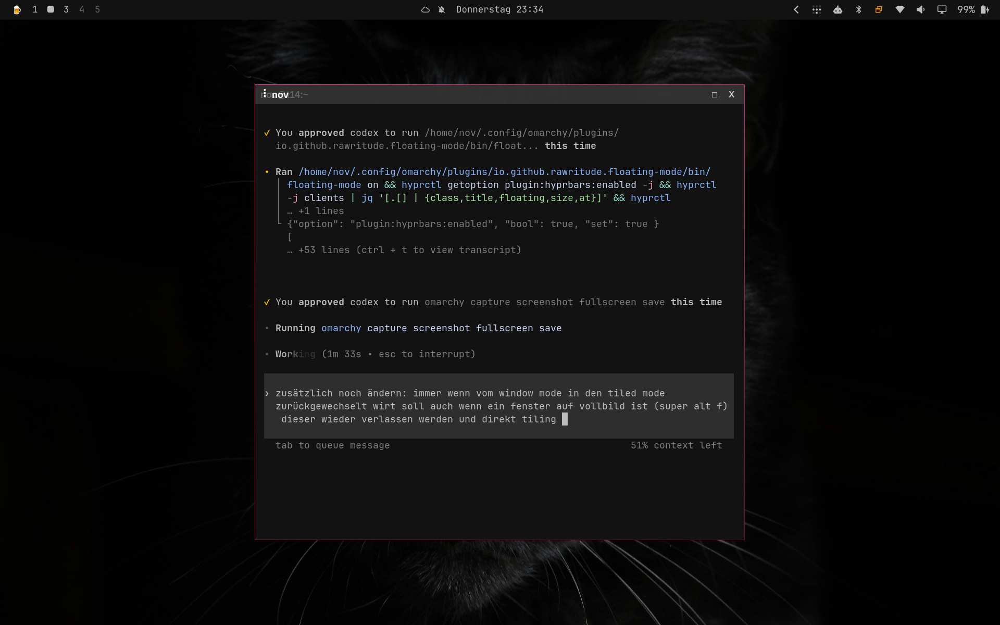

# Floating Window Mode for Omarchy

Floating Mode adds a clean tiled ↔ floating toggle to the Omarchy bar. It is designed especially for large and ultrawide monitors, where a single maximized application wastes space and traditional tiling can feel too rigid.

One click turns the current desktop into a calm, free-form workspace. Windows keep a useful visual arrangement, newly opened applications appear centered with comfortable margins, and another click returns every window managed by the plugin to tiling.



## What it does

- Toggles between tiled and floating workflows from one Omarchy bar button
- Floats existing tiled windows instantly, without distracting transition animations
- Automatically floats applications opened while Floating Mode is active
- Centers a lone or newly opened window at no more than 70% of the usable scaled screen area
- Never enlarges naturally smaller dialogs
- Preserves the overview on busy workspaces by keeping window positions and shrinking them only slightly
- Handles monitor scale, rotation, reserved bar space, and multi-monitor coordinates
- Leaves windows that were already floating untouched when returning to tiled mode
- Exits maximized or fullscreen state before restoring managed windows to tiling
- Adds a compact native titlebar for dragging, maximizing, and closing windows

The result is simple: tiling when you want structure, floating when you want space and context.

## Requirements

### Runtime

- Omarchy 4 (Quattro)
- Hyprland 0.56 or newer
- Omarchy Shell / Quickshell
- `hyprctl`
- `jq`

These runtime components are included with a standard current Omarchy installation.

### One-time titlebar setup

The native titlebar uses the official Hyprland `hyprbars` plugin without modifying its native code. Its installer requires:

- Internet access to GitHub
- An interactive terminal
- `hyprpm`
- `install`, `sed`, `grep`, and `awk`

The installer checks every required command before making changes. `hyprpm` selects and builds the official source revision pinned for the installed Hyprland ABI; Floating Mode does not clone source, patch native code, or use `sudo`.

See [DEPENDENCIES.md](DEPENDENCIES.md) for the complete audited dependency and privilege list.

## Installation

Run these commands after the GitHub repository is public:

```bash
omarchy plugin add https://github.com/jwm3000/omarchy-windows.git --enable --yes
omarchy bar move io.github.rawritude.floating-mode --section right
~/.config/omarchy/plugins/io.github.rawritude.floating-mode/contrib/install-hyprbars
```

The final command is intentionally separate because Omarchy does not execute installation hooks when adding a plugin. Read [`contrib/install-hyprbars`](contrib/install-hyprbars) before running it if you want to review every change.

## Usage

Click the overlapping-windows icon in the Omarchy bar:

- Normal icon: tiled mode
- Highlighted icon: Floating Mode is active
- Click again: managed windows return directly to tiling

In Floating Mode, use the native titlebar to drag a window. The square button toggles maximization and the close button closes the window.

Runtime state is kept in `$XDG_RUNTIME_DIR/omarchy-floating-mode` and disappears at logout. No window content is read or stored.

## Updating

Update community plugins with Omarchy:

```bash
omarchy plugin update --yes
```

If an update changes `contrib/hyprbars.lua`, rerun:

```bash
~/.config/omarchy/plugins/io.github.rawritude.floating-mode/contrib/install-hyprbars
```

Because Hyprland plugins are ABI-sensitive, rerun the installer after a Hyprland update if `hyprbars` no longer loads.

## Removal

First click the bar button to return to tiled mode. Then run:

```bash
~/.config/omarchy/plugins/io.github.rawritude.floating-mode/contrib/install-hyprbars --uninstall
omarchy plugin remove io.github.rawritude.floating-mode --yes
```

The uninstall step removes the added Lua configuration, restores hyprbars' previous enabled state, reloads Hyprland, and removes the plugin's installer state.

If the widget is unavailable while Floating Mode is still active, restore tiling manually before removing the plugin:

```bash
~/.config/omarchy/plugins/io.github.rawritude.floating-mode/bin/floating-mode off
```

## How it works

The headless service watches for newly mapped tiled windows while the mode is enabled. Geometry is calculated in Hyprland's logical coordinate space, so fractional scaling and large displays remain predictable. Each transition is sent as one animation-free Hyprland batch to avoid visible intermediate layouts.

Only window addresses changed by Floating Mode are recorded. When the mode is disabled, only those windows return to tiling.

Titlebars and their maximize and close controls are rendered inside the compositor by the official [`hyprbars`](https://github.com/hyprwm/hyprland-plugins/tree/main/hyprbars) plugin through its standard `add_button` interface.

## Privacy and security

- Runtime operation is local and unprivileged
- The plugin reads window geometry and metadata from `hyprctl`, never window contents
- No telemetry, analytics, network requests, or background downloads are used at runtime
- Network access occurs only when the explicit titlebar installer invokes `hyprpm`
- Floating Mode neither builds nor installs privileged executable code and never invokes `sudo`
- Persistent configuration is limited to `~/.config/hypr/floating-mode.lua`, one `require(...)` line, and reversible state below `$XDG_STATE_HOME`

## Development and validation

```bash
omarchy plugin validate .
qmllint -I /usr/share/omarchy/shell BarWidget.qml Service.qml
bash -n bin/floating-mode contrib/install-hyprbars
```

For a local test installation, clone or copy the repository to:

```text
~/.config/omarchy/plugins/io.github.rawritude.floating-mode
```

Then rescan and enable it:

```bash
omarchy-shell shell rescanPlugins
omarchy plugin enable io.github.rawritude.floating-mode
```

## Publishing on Omarchy Plugins

This repository already contains the required root-level `manifest.json`, README, MIT license, and optional preview image. Before submission:

1. Push the repository to `https://github.com/jwm3000/omarchy-windows` and make it public.
2. Confirm the default branch contains a clean release commit.
3. Run the validation commands above on current Omarchy.
4. Submit the public repository URL at [omarchyplugins.com](https://omarchyplugins.com/publish.html).

The marketplace validates the listing and repository layout; plugins themselves run with the user's normal account permissions.

## License

MIT — see [LICENSE](LICENSE).
